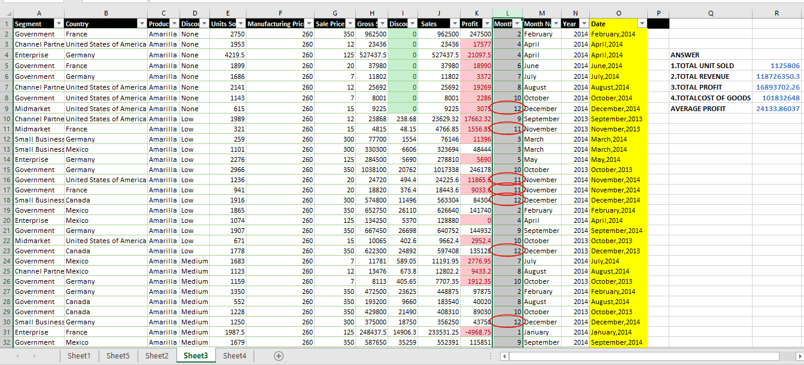
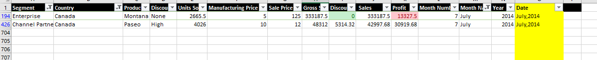

# DATA-ANALYSIS-TRAINING
***
# Welcome to My Data Analysis Journey!

Hi there! My name is **June**, and I'm documenting my journey into data analysis on GitHub. I have always been interested in working with data and am excited to share my projects and insights with the community.

In this repository, you'll find my Excel projects along with documentation on my process and insights. I hope that my journey will inspire others to explore the world of data science.


If you have any questions or suggestions, feel free to reach out. Happy exploring!

# Data Analysis

## Definition:
Data analysis is the process of examining and interpreting data using various analytical and statistical techniques to extract meaningful insights and draw conclusions from the data. This involves collecting, cleaning, organizing, and transforming data into a format that is suitable for analysis. The goal of data analysis is to uncover patterns, relationships, and trends in the data that can be used to make informed decisions or predictions. Data analysis is widely used in various fields such as business, finance, healthcare, science, and social sciences, among others, to gain insights into complex phenomena and inform decision-making processes.

---

## Documenting your project:
Creating a .com website  
GitHub  
Others include (e.g., Carrd, Wix, Google Sites, Medium, etc.)

## Important aspects of Data Analysis:
1. **Data Collection :** This involves gathering data from various sources such as surveys,experiments, observation, databases, and web scraping. It is important to ensure that the data collected is reliable, accurate, and relevant to the research question or problem being investigated.
2. **Data Cleaning:** This is the process of identifying and correcting errors, inconsistencies, missing values, and outliers in the data. Data cleaning is essential to ensure that the data is of high quality and suitable for analysis.
3. **Data Exploration:** This involves visualizing and summarizing the data using various techniques such as histograms, box plots, scatterplots, and summary statistics. Data exploration helps to identify patterns, trends, and relationships in the data.
4. **Data Transformation:** This is the process of converting data into a format that is suitable for analysis. This may involve transforming variables, creating new variables, and standardizing data.
5. **Statistical Analysis:** This involves applying statistical methods and techniques such as regression analysis, hypothesis testing, and analysis of variance to the data to draw conclusions and make predictions.
6. **Data Visualization:** This involves presenting the data in a visual format such as charts,graphs, and dashboards to communicate insights and findings to stakeholders.
7. **Machine Learning:** This involves building predictive models using algorithms and statistical models to analyze and make predictions based on the data.
By understanding these subheadings, you can gain a solid foundation in data analysis and develop the skills necessary to conduct meaningful analysis and draw insightful conclusions from data.
 ***
 
## Software and Tools you need to learn:
here's a suggested order for learning the tools and subheadings in data analysis:
1. **Spreadsheet Software:** Start by learning how to use spreadsheet software such as Microsoft Excel or Google Sheets. These tools can be used for basic data analysis tasks such as data cleaning, transformation, and visualization.
2. **SQL:** Once you're comfortable with spreadsheet software, learn SQL (Structured Query Language). SQL is a programming language used to manage and manipulate data stored in relational databases. It's a fundamental tool for data analysts, and it's important to learn how to write SQL queries to extract data and perform data analysis tasks.
3. **Statistical Software:** After learning SQL, move on to learning statistical software such as R or Python with libraries like NumPy, Pandas, and SciPy. These tools can be used for more advanced data analysis tasks such as statistical modeling and machine learning.
4. **Data Visualization Tools:** Once you have a good grasp of statistical software, learn data visualization tools such as Tableau, Power BI, and D3.js. These tools can be used to create interactive and engaging visualizations of data.
5. **Data Integration and Transformation Tools:** Next, learn tools such as Talend, Apache NiFi,and Pentaho that can be used to integrate, clean, and transform large volumes of data from multiple sources.
6. **Cloud-Based Services:** Finally, consider learning about cloud-based services such as Amazon Web Services (AWS) or Microsoft Azure. These services provide access to powerful computing resources, storage, and data analysis tools, making it easy to perform large-scale data analysis tasks.
By following this order, you can build a solid foundation in data analysis and develop the skills necessary to perform meaningful analysis and draw insightful conclusions from data.
***
# Software Installation:
Below are links to short YouTube videos that will help you with the installation of Excel, SQL and PowerBI .
***If you cannot afford to pay for it, the video on Excel provides an alternative way to have Excel running and working for you***
[Excel:](https://youtu.be/pL3HmenP7ro)
[SQL:](https://youtu.be/2c2fUOgZMmY)
[PowerBI:](https://youtu.be/GT2NcTE6UEo)
Meanwhile, an alternative way to access Excel and PowerBI via [Microsoft 365](https://www.microsoft.com/en/microsoft-365/buy/compare-all-microsoft-365-products?market=af&tab=1&rtc=1) Or [Office](www.office.com)
***
# A. Excel

***
## A brief overview of Microsoft Excel:
Microsoft Excel is a spreadsheet software developed by Microsoft. It's widely used for various data-related tasks such as data entry, analysis, and visualization. Excel is equipped with a vast array of features that allow users to perform complex data analysis tasks easily. Here are some key features of Excel:
1. **Data Entry and Management:** Excel allows you to enter, store, and manage data in a tabular format. You can create tables, add and edit data, and sort and filter data to
make it easier to analyze.
2. **Formulas and Functions:** Excel has a wide range of built-in formulas and functions that can be used to perform various calculations on data. These include basic arithmetic operations, statistical functions, and financial functions.
3. **Charts and Graphs:** Excel has a variety of chart and graph types that allow you to visualize your data in different ways. You can create bar charts, line charts, pie charts, and more, and customize them to fit your specific needs.
4. **PivotTables and PivotCharts:** PivotTables and PivotCharts are powerful tools that allow you to summarize, analyze, and visualize large amounts of data quickly and easily. They enable you to create dynamic reports that can be updated with new data automatically.
5. **Macros:** Macros are sets of instructions that automate repetitive tasks in Excel. They can be used to speed up data analysis tasks and improve efficiency.
6. **Add-ins:** Excel has a range of add-ins that can be installed to extend its functionality. These add-ins can be used for specific tasks such as data analysis, financial modeling, and statistical analysis. By mastering these features, you can use Excel to perform a wide range of data-related tasks, from basic data entry to complex data analysis and visualization.
***
## A Beginner guide to excel:
Sure! Let's start with the basics:
1. **The Excel Interface:** The Excel interface is made up of several elements, includin the Ribbon, Quick Access Toolbar, and Worksheet. The Ribbon contains all of the tools
and commands you need to work with Excel, while the Quick Access Toolbar provides easy access to frequently used commands. The Worksheet is where you enter and manipulate data.
2. **Entering Data:** To enter data in Excel, simply click on the cell where you want to enter data and start typing. You can enter text, numbers, dates, and formulas. To move to a different cell, use the arrow keys or click on the cell.
3. **Formatting Data:** Excel allows you to format data to make it easier to read and analyze. You can change the font, size, and color of text, as well as the background color of cells. You can also apply number formats to display values in different formats,such as currency, percentages, or scientific notation.
4. **Formulas and Functions:** Formulas are equations that perform calculations on data in Excel. Functions are pre-built formulas that perform specific calculations, such as SUM, AVERAGE, and COUNT. To create a formula or function, start by typing "=" in thecell where you want to display the result, and then enter the formula or function.
5. **Charts and Graphs:** Excel allows you to create a wide range of charts and graphs to visualize your data. To create a chart, select the data you want to include in the chart, click on the Insert tab in the Ribbon, and select the chart type you want to create. You can then customize the chart by changing the chart type, adding titles and labels, and changing the colors and formatting.
6. **PivotTables:** PivotTables are a powerful tool for summarizing and analyzing large amounts of data. They allow you to quickly create custom reports that summarize data in different ways. To create a PivotTable, select the data you want to include in the PivotTable, click on the Insert tab in the Ribbon, and select PivotTable.
7. **Macros:** Macros are sets of instructions that automate repetitive tasks in Excel. You can record a macro by selecting the Developer tab in the Ribbon, clicking on the Record
Macro button, performing the actions you want to automate, and then stopping the macro recording.
***
## more advanced Excel topics:
1. **Data Analysis:** Excel has many powerful tools for analyzing data, such as the Data Analysis Toolpak, which provides advanced statistical functions. You can use these tools to perform regression analysis, hypothesis testing, and other statistical analyses.
2. **Conditional Formatting:** Conditional formatting allows you to apply formatting to cells based on specific conditions. For example, you can highlight cells that contain values above or below a certain threshold, or cells that contain specific text or values.
3. **Data Validation:** Data validation allows you to set rules for the type of data that can be entered into a cell. For example, you can restrict data to a specific range of values, or require that data be entered in a certain format.
4. **Advanced Charting:** Excel allows you to create complex charts and graphs that can display multiple data series, trendlines, and more. You can also create combination charts that display multiple chart types on the same chart.
5. **VBA Programming:** Visual Basic for Applications (VBA) is a programming language that can be used to automate tasks in Excel. With VBA, you can create custom functions, automate data entry tasks, and even build custom user interfaces.
6. **Power Query and Power Pivot:** Power Query and Power Pivot are advanced Excel features that allow you to perform complex data transformations and create custom data models. Power Query allows you to connect to external data sources and transform data before bringing it into Excel, while Power Pivot allows you to create relationships between tables and perform advanced calculations.
***
# A practical guide to Analsing a dataset in excel:
basic steps you can follow to analyze a dataset using Excel:
1. **Prepare your data:** Before you can analyze your data, you need to make sure it's in the right format. This means cleaning and organizing your data so that it's easy to work with. You can use Excel's data cleaning and formatting tools to do this.
2. **Import your data:** If your data is in an external file, you need to import it into Excel. You can do this using Excel's built-in import tools, which allow you to import data from a variety of sources, including CSV files, databases, and web pages.
3. **Create a PivotTable:** Once your data is in Excel, you can use a PivotTable to analyze it. A PivotTable is a dynamic summary report that allows you to summarize and analyze large amounts of data quickly and easily. You can create a PivotTable by selecting your data and clicking the PivotTable button on the Insert tab.
4. **Choose your fields:** In order to create a PivotTable, you need to choose the fields that you want to analyze. These fields can include things like dates, categories, and numeric values. You can drag and drop these fields into the rows, columns, and values sections of your PivotTable.
5. **Analyze your data:** Once you have created your PivotTable, you can start analyzing your data. Excel provides a variety of tools that allow you to filter, sort, and group your data, as well as perform calculations and create charts and graphs.
6. **Draw conclusions:** After you have analyzed your data, you can draw conclusions and make decisions based on your findings. You can use your PivotTable and other Excel tools to identify patterns, trends, and outliers in your data, and make informed decisions based on your analysis.
***
# WEEK 1 - EXCEL

## Task 1
Create and populate a table (10 rows) with the following information
1. *Student Name*
2. *Age*
3. *Height*
4. *Year of birth*
5. *Exam score*
6. *Format Student names in ascending order
*Calculate the total of the Exam score* and highlight the scores that are above average.
### Answer
To solve the task, I created a student data using characters from [Avater the last air bender],I then used the sorting function to arrange the students name in ascending order and calulated both the  total exam score and average. Finally I used the average score to carry out a conditional formatting where only the student that scored above average were highlighted.

.png)

## Task 2 BUSINESS CASE
1. calculate the total revenue and profit Generated by company X.
2. Highlight cells where the unit sold are greater than average.
3. show only the segments in Canada where over 2000 products were sold.
### Answer
To solve the task,I used the sum function to calculate total revenue (SALES) and profit , then used conditional formating to highligh units sold that are greater than the average i calculated and finally i used the filter function to show the question 3.

.png)

***
## WEEK 1 TASK: SALES DATA
1. Total units sold.
2. Total revenue generated.
3. Total profits made.
4. Total cost of goods.
5. Highlight cells with profit less than average profit.
6. Create a full date column containing months and year.
7. Highlight cells where discount equals to zero
8. Sort the product column in ascending order.
9. Show information for the product sold in Canada under the segment 'Enterprise' and ' Channel partners'for the month july.
10. Set a rule for the month number columnb. The rule should allow only for values from (1 - 10): Show cells that did not meet with this condition using the data validation feature.
### Answer
To solve this, I used the sumfunction to answer question 1-4,I calculated the average and used conditional formating to answer question 6&7, I used the filter function to solve question 8 and 9 and finally I used data validation function to answer question 10.
#### Week1 TASK 1-8,10



#### TASK 9


***
# WEEK 2 - EXCEL formulas and function:
Excel formulas and functions are powerful tools that allow users to perform various calculations and operations within spreadsheets. Here are some important concepts and functions you should be aware of:

- **BODMAS:** This stands for Bracket, Order, Division, Multiplication, Addition, and Subtraction. It is a mathematical rule used to determine the order of operations when evaluating mathematical expressions.

- **Relative and Absolute referencing:** When using formulas in Excel, cell references can be either relative or absolute. A relative reference changes as it is copied or filled, whereas an absolute reference remains constant. Absolute referencing is denoted by a "$" sign before the column and/or row reference.
- **RAND and RANDBETWEEN:** These functions generate random numbers in Excel. RAND produces a random number between 0 and 1, while RANDBETWEEN generates a random integer between a specified range of values.
- **Transpose:** in Excel this means flipping the orientation of data in a table or range of cells, converting the rows of a table into columns, or vice versa.

## Basic functions:
- **SUM:** adds up a range of cells.
- **AVERAGE:** calculates the average of a range of cells.
- **MAX:** finds the highest value in a range.
- **MIN:** finds the lowest value in a range.
- **COUNT:** counts the number of cells in a range that contain numbers.
- **COUNTA:** counts the number of non-empty cells in a range.
- **CONCATENATE:** joins two or more strings together.

## Advanced Functions:
- **VLOOKUP and HLOOKUP:** used to search for a value in a table and return a corresponding value from another column or row.
- **INDEX and MATCH:** also used for table lookups.
- **XLOOKUP:** a newer function that can be used as a replacement for VLOOKUP and HLOOKUP.
- **IF:** used for conditional statements.
- **SUMIF:** used for conditional sums.
- **COUNTIF:** used for conditional counts.
- **AVERAGEIF:** used for conditional averages.
 
| **Function**       |**Excel Formula**                                |
|--------------------|-------------------------------------------------|
| SUM                | `=SUM(range)`                                   |
| AVERAGE            | `=AVERAGE(range)`                               |
| MAX                | `=MAX(range)`                                   |
| MIN                | `=MIN(range)`                                   |
| COUNT              | `=COUNT(range)`                                 |
| COUNTA             | `=COUNTA(range)`                                |
| CONCATENATE        | `=CONCATENATE(text1, text2, ...)`               |
| VLOOKUP            | `=VLOOKUP(lookup_value, table_range, col_index)`|
| HLOOKUP            | `=HLOOKUP(lookup_value, table_range, row_index)`|
| INDEX and MATCH    | `=INDEX(return_range, MATCH(lookup_value, lookup_range, 0))` |
| XLOOKUP            | `=XLOOKUP(lookup_value, lookup_range, return_range)` |
| IF                 | `=IF(condition, value_if_true, value_if_false)` |
| SUMIF              | `=SUMIF(range, criteria, sum_range)`             |
| COUNTIF            | `=COUNTIF(range, criteria)`                      |
| AVERAGEIF          | `=AVERAGEIF(range, criteria, average_range)`     |

***
## PIVOT TABLES IN EXCEL:
Pivot tables are a powerful feature in Excel that allow you to summarize and analyze large amounts of data in a structured and dynamic way. They provide a flexible and interactive way to organize, summarize, and extract insights from your data.

1. **Data Source**: A pivot table requires a data source, which can be an Excel table, a range of cells, or an external data connection. The data should be organized in columns with headers.

2. **Structure**: Pivot tables have a structure with rows, columns, values, and filters. These elements allow you to arrange and analyze your data in various ways.

3. **Row and Column Fields**: You can select one or more columns from your data to be used as row or column fields in the pivot table. These fields determine the structure and grouping of the data in the table.

4. **Value Field**: The value field represents the data that you want to summarize or perform calculations on. It could be a sum, average, count, maximum, minimum, or any other type of calculation.

5. **Filters**: Filters allow you to narrow down the data displayed in the pivot table based on specific criteria. You can apply filters to one or more fields to focus on specific subsets of data.

6. **Dynamic and Interactive**: Pivot tables are dynamic and interactive, meaning you can easily change the arrangement of the data by dragging and dropping fields. You can quickly switch rows and columns, add or remove fields, and modify calculations, providing real-time updates to the results.

7. **Aggregation and Calculation**: Pivot tables automatically aggregate and summarize your data based on the selected fields and calculations. You can perform various calculations on the value field, such as sum, average, count, etc., to gain insights from the data.

8. **Drill-Down**: Pivot tables allow you to drill down into the underlying data. By double-clicking on a cell, you can see the detailed data that makes up that value.

Pivot tables are especially useful when dealing with large datasets and complex data analysis tasks. They enable you to quickly analyze and visualize data from different perspectives, identify patterns, trends, and outliers, and make data-driven decisions more effectively.

.png)
***
## PIVOT CHART:
Pivot charts are visual representations of data that are created from pivot tables in Excel. They provide a dynamic and interactive way to analyze and summarize large datasets. Pivot charts allow you to visualize trends, patterns, and relationships within your data, making it easier to derive insights and communicate information effectively.

### Here's how to use pivot charts in Excel:

1. **Prepare Your Data**: Ensure that your data is well-structured, organized, and contains headings for each column. Remove any blank rows or columns. It's best to have your data in a tabular format.

2. **Create a Pivot Table**: Select your data range and go to the "Insert" tab in Excel's ribbon. Click on the "PivotTable" button and specify the data range you want to analyze. Choose where to place the pivot table (either in a new worksheet or an existing one).

3. **Design the Pivot Table**: In the PivotTable Field List, drag and drop the relevant fields from your data into the "Rows" and "Values" areas. This defines how your data will be summarized and analyzed.

4. **Add a Pivot Chart**: With the pivot table selected, go to the "Insert" tab and click on the desired chart type in the "Charts" group. Select the specific chart style you want to use.

5. **Configure the Pivot Chart**: The "PivotChart Fields" or "Chart Fields" pane will appear, similar to the PivotTable Field List. Drag and drop fields into the appropriate areas such as "Axis (Categories)", "Values", or "Legend" to define the chart's data series and categories.

6. **Customize the Pivot Chart**: Excel provides options to customize the appearance and layout of the pivot chart. You can modify chart elements, apply different chart styles, adjust colors and fonts, add titles and labels, and more.

7. **Interact with the Pivot Chart**: Pivot charts are interactive by default. You can explore your data dynamically by filtering, sorting, or drilling down into specific areas of the chart. Use the filter controls available on the chart to refine the displayed data.

8. **Update the Pivot Chart**: If your underlying data changes or if you modify the pivot table, the pivot chart will automatically update to reflect those changes. You can also manually refresh the chart by right-clicking on it and selecting "Refresh" or by refreshing the pivot table data.

Pivot charts provide a visual representation of the summarized data in your pivot table, allowing you to identify trends, compare values, and present insights effectively. They are an essential tool for data analysis and reporting in Excel, as they enable you to transform raw data into meaningful visualizations.
.png)
***
```
# WEEK2- TASK 1
Using the sales dataset provided,carryout the following
## FORMULAS & FUNCTION
1. sum of product sold under government segment
2. Average profit made in Canada
3. Total number of sales made where gross sales is less than average
## PIVOT TABLE
1. Total discounts made available in each country
2. Total revenue generated each months alongside the total profit
```
# ANSWER
| Calculation                                                  | Excel Formula                                                          |
|--------------------------------------------------------------|------------------------------------------------------------------------|
|1. Sum of products sold under government segment              | `=SUMIF(SegmentRange, "Government", UNITSOLDRange)`                    |
|2. Average profit made in Canada                              | `=AVERAGEIF(CountryRange, "Canada", ProfitRange)`                      |
|3. Total number of sales where gross sale is less than average| `=COUNTIF(GrossSaleRange, "<" & AVERAGE(GrossSaleRange))`              |

### Solution (Question 1,2,3)
.png)

### solution: PIVOT TABLE 1 & 2
.png)

***
# EXCEL DASHBOARD
**What are Excel Dashboards?**

Excel dashboards are visual representations of data that provide a concise and interactive overview of key metrics, trends, and insights. They allow data analysts to present complex information in a user-friendly and visually appealing format. Excel dashboards combine charts, tables, and other visual elements to facilitate data analysis, decision-making, and communication.

**How to Create Excel Dashboards:**

1. **Define the Purpose**: Clearly define the purpose of your dashboard. Identify the key metrics and insights you want to convey to your audience.

2. **Gather and Prepare Data**: Collect and organize the relevant data for your dashboard. Ensure that the data is accurate, complete, and well-structured. Cleanse and format the data as needed.

3. **Plan the Layout**: Sketch out the layout of your dashboard. Determine the arrangement of charts, tables, and other elements to optimize clarity and visual flow.

4. **Select Appropriate Visualizations**: Choose the right charts and graphs to represent your data effectively. Consider the type of data, relationships, and patterns you want to highlight. Excel offers various chart types to choose from.

5. **Create Visual Elements**: Build your visualizations using Excel's charting tools. Customize the appearance, labels, colors, and formatting to enhance readability and visual appeal. Use consistent styles across the dashboard for a cohesive look.

6. **Utilize Pivot Tables**: Incorporate pivot tables to summarize and analyze large datasets. Use them to aggregate, filter, and slice data dynamically. Pivot tables allow users to explore data from different angles.

7. **Apply Conditional Formatting**: Apply conditional formatting to emphasize important data points or highlight trends. Use color scales, data bars, and icons to visually represent data based on specific criteria. This enhances data interpretation.

8. **Include Interactive Elements**: Add interactive controls like drop-down lists, checkboxes, or slicers. These allow users to filter and interact with the data dynamically, providing a more personalized experience.

9. **Incorporate Formulas and Functions**: Use Excel formulas and functions to perform calculations, data transformations, or derive additional insights. Functions such as SUM, AVERAGE, COUNT, IF, and VLOOKUP are valuable for data analysis within your dashboard.

10. **Ensure Data Refresh**: If your dashboard relies on live or regularly updated data, establish a process to refresh the data automatically. Utilize Excel's data connections or Power Query to pull data from external sources and update your dashboard with the latest information.

11. **Document and Share**: Document any assumptions, methodologies, or explanations related to your dashboard. Provide clear instructions on how to navigate and interpret the dashboard. Share your dashboard with stakeholders in formats such as Excel files, PDFs, or interactive tools like Excel Online or Power BI.

Remember to iterate and refine your dashboard based on feedback and changing requirements. Explore additional Excel features and functionalities to enhance your dashboards, and consider leveraging specialized dashboarding tools if you require more advanced capabilities.

Creating Excel dashboards allows you to present data in a compelling and meaningful way, empowering decision-makers with actionable insights.
***
# Full Excel Project
```
 ## PROJECT DETAILS
## Requirements:
Using the Superstore Sales Dataset provided, carefully analyze and provide answers to the following questions
1. Total revenue generated
2. Highest revenue generated
3. Lowest revenue generated
4. Total number of sales made
5. Number of cities where this business is located
6. Determine the customers responsible for the Highest sales and Lowest sales generated by the company
8. What is the total revenue generated in Kentucky? (a state)
9. Using pivot tables, show the following insights
a. Sales by category
b. Sales by sub-category
c. Sales by state
d. Sales by region
e. Ship modes and their preference by customers
f. How sales vary by segment
g. Order and Sales by Year
h. Order and Sales by Month
10. Build an interactive dashboard showing the insights above.
```

.png)

***
# Answer
**First Analysis:** The dataset looked pretty clean but for the Order date and ship date column which contained a combination of Text an Date. I solved this by creating a new column where I used the formula on the number 9 of the table below. the formula is an if statement that check each cell to determine if its a date or text, it allows the date and fix the text into a datevalue. I copied the the new column and paste special- values into the error column and then delete the new column.
***
**Second Analysis** To solve the business question 1-8 i used the folowing formula in the table below. 
## Business question 1-8
| Number | Question                                      | Excel Formula                                                        |
|--------|-----------------------------------------------|----------------------------------------------------------------------|
| 1      | Total revenue generated                       | `=SUM(range_of_sales)`                                               |
| 2      | Highest revenue generated                     | `=MAX(range_of_sales)`                                               |
| 3      | Lowest revenue generated                      | `=MIN(range_of_sales)`                                               |
| 4      | Total number of sales made                    | `=COUNTA(range_of_sales)`                                            |
| 5      | Number of cities where the business is located| `=COUNTA(UNIQUE(range_of_cities))-1`                                 |
| 6      | Customers responsible for highest sales       | `=INDEX(customer_column, MATCH(MAX(sales_column), sales_column, 0))` or =XLOOKUP(MAX(sales_column), sales_column, customer_column)                                                                      |
| 7      | Customers responsible for lowest sales        | `=INDEX(customer_column, MATCH(MIN(sales_column), sales_column, 0))` or =XLOOKUP(MIN(sales_column), sales_column, customer_column)                                                                      |
| 8      | Total revenue generated in Kentucky           | `=SUMIFS(revenue_column, state_column, "Kentucky")`                  |
| 9      | Convert text and date to date in a column     | `=IF(ISNUMBER(A1), DATEVALUE(A1), DATEVALUE(TEXT(A1, "dd/mm/yyyy")))`|

.png)
***
**Third Analysis:** To solvre business question 9 I selected the data by using ctrl + shift + arrow left + arrow down, then i inserted the different pivot tables. for 9h i grouped the date filter to get months.
**Business Question 9a-f**

.png)

**Business Question 9g-h**

.png)
***
**Fourth Analysis:** I used thge 8 pivot tables to created a pivot chart for visualization of the data.
.png)
***
**Fifth Analysis:** I created a dashboard representing the kpI and added interactivity to it by including search button for the customers,links and icons,slicers etc

.png)

**Sixth Analyis:** It is important to use rhyming color pallete to create a coherent visuals for the dashboards. This pallete are availaibe in sites like coolor.co and all that is needed is copying paste it in the customizwe color option of excel.
to imrove the visualization on my dashboard i used this color pallette

| Name         | Color Code |
|--------------|------------|
| Dark Teal    | #2C6E49    |
| Forest Green | #4C956C    |
| Cream        | #FEFEE3    |
| Peach        | #FFC9B9    |
| Copper       | #D68C45    |


***
# MySQL

## MySQL Workbench for Data Analysts

### Database Connection
1. Launch MySQL Workbench and establish a connection to your MySQL database by clicking on "Database" and selecting "Connect to Database."

### SQL Syntax and Execution
1. Querying Data: Use the SQL `SELECT` statement to retrieve data from tables.
```sql
SELECT column1, column2
FROM table_name
WHERE condition;
```

2. Filtering Results: Utilize the `WHERE` clause to filter query results based on specific conditions.
```sql
SELECT column1, column2
FROM table_name
WHERE condition1 AND condition2;
```

3. Sorting Data: Apply the `ORDER BY` clause to sort query results in ascending or descending order.
```sql
SELECT column1, column2
FROM table_name
ORDER BY column1 ASC;
```

4. Aggregating Data: Aggregate data using functions such as `COUNT`, `SUM`, `AVG`, etc.
```sql
SELECT COUNT(column1), AVG(column2)
FROM table_name
GROUP BY column3;
```

5. Joining Tables: Combine data from multiple tables using different types of joins (`INNER JOIN`, `LEFT JOIN`, `RIGHT JOIN`, `FULL JOIN`).
```sql
SELECT *
FROM table1
JOIN table2 ON table1.column1 = table2.column2;
```

### Data Manipulation
1. Inserting Data: Use the `INSERT INTO` statement to add new records to a table.
```sql
INSERT INTO table_name (column1, column2)
VALUES (value1, value2);
```

2. Updating Data: Update existing records using the `UPDATE` statement.
```sql
UPDATE table_name
SET column1 = new_value
WHERE condition;
```

3. Deleting Data: Remove specific records from a table with the `DELETE` statement.
```sql
DELETE FROM table_name
WHERE condition;
```

### Database Design
1. Creating Tables: Use the `CREATE TABLE` statement to define the structure of a new table.
```sql
CREATE TABLE table_name (
    column1 datatype,
    column2 datatype,
    ...
);
```

2. Modifying Tables: Alter existing tables using `ALTER TABLE` statement to add, modify, or drop columns.
```sql
ALTER TABLE table_name
ADD column_name datatype;

ALTER TABLE table_name
MODIFY COLUMN column_name datatype;

ALTER TABLE table_name
DROP COLUMN column_name;
```

### Exporting and Importing Data
1. Exporting Data: Right-click on a table, select "Table Data Export Wizard," and choose the desired export format (e.g., CSV, SQL).

2. Importing Data: Right-click on a table, select "Table Data Import Wizard," and follow the steps to import data from a file.

### Visual Database Design
1. Entity-Relationship Diagrams: Use the "Modeling" perspective to create Entity-Relationship (ER) diagrams and visually design the database schema.

### Note: 
This guide provides an overview of essential MySQL Workbench features and syntax commonly used by data analysts. However, MySQL Workbench offers additional functionalities for database administration, stored procedures, and more. For further information, consult the MySQL Workbench documentation.
***
Here's the formatted text in Markdown:

## Task One
1. Create a database named `students_information`.
2. In the database you have created, create a table that has the following columns with the right data type:
   - `students_Id`
   - `first_name`
   - `last_name`
   - `Age`
   - `Exam_score`
   - `passing_grade` (A, B, C, D).
3. Populate the table for 10 students.

### Answer
```sql
-- Create the database
CREATE DATABASE students_information;
USE students_information;

-- Create the students table
CREATE TABLE students (
    students_Id INT PRIMARY KEY,
    first_name VARCHAR(50),
    last_name VARCHAR(50),
    Age INT,
    Exam_score INT,
    passing_grade CHAR(1)
);

-- Insert data into the students table
INSERT INTO students (students_Id, first_name, last_name, Age, Exam_score, passing_grade) VALUES
    (1, 'Aang', 'Airbender', 112, 90, 'A'),
    (2, 'Katara', 'Waterbender', 15, 85, 'B'),
    (3, 'Sokka', 'Warrior', 16, 78, 'C'),
    (4, 'Toph', 'Beifong', 12, 92, 'A'),
    (5, 'Zuko', 'Firebender', 17, 88, 'B'),
    (6, 'Azula', 'Firebender', 14, 95, 'A'),
    (7, 'Iroh', 'Dragon', 60, 89, 'B'),
    (8, 'Suki', 'Kyoshi Warrior', 16, 87, 'B'),
    (9, 'Mai', 'Assassin', 17, 84, 'B'),
    (10, 'Ty Lee', 'Circus Performer', 16, 82, 'C');
```
.png)
***
### Task two
1. insert 5 more rows of infformation into the table you already created
2. update the Scores and Grades of the first 5 students in your Table to the following respectively ( scores: 60,65,50.5,45 and 71.5) (Grades: B,B,C,D and A)
3. delete the records of student id 6,7,8,9,10
4. Show the first Names and Grades of every student
5. show the records for students with the following GRades only (Grades : A and B)
#### ANSWER

### Task Two

1. Insert 5 more rows of information into the table you already created.

```
#### Answer - Inserting 5 More Rows

To insert 5 more rows into the existing table, you can use the following syntax:

```sql
INSERT INTO students (students_Id, first_name, last_name, Age, Exam_score, passing_grade) VALUES
    (11, 'SokkI', 'Swordmaster', 18, 85, 'B'),
    (12, 'ZukI', 'Firelord', 19, 92, 'A'),
    (13, 'AzulI', 'Princess', 17, 78, 'C'),
    (14, 'KatarI', 'Healer', 20, 90, 'A'),
    (15, 'TopI', 'Metalbender', 16, 88, 'B');
```
.png)

2. Update the Scores and Grades of the first 5 students in your table to the following respectively (scores: 60, 65, 50.5, 45, and 71.5) (Grades: B, B, C, D, and A).

```
#### Answer - Updating Scores and Grades

To update the scores and grades of the first 5 students in your table, you can use the following syntax:

```sql
UPDATE students
SET Exam_score = CASE students_Id
    WHEN 1 THEN 60
    WHEN 2 THEN 65
    WHEN 3 THEN 50.5
    WHEN 4 THEN 45
    WHEN 5 THEN 71.5
    ELSE Exam_score
    END,
    passing_grade = CASE students_Id
    WHEN 1 THEN 'B'
    WHEN 2 THEN 'B'
    WHEN 3 THEN 'C'
    WHEN 4 THEN 'D'
    WHEN 5 THEN 'A'
    ELSE passing_grade
    END
WHERE students_Id IN (1, 2, 3, 4, 5);
```
.png)

3.#### Answer - Deleting Records

To delete the records of student IDs 6, 7, 8, 9, and 10 from the `students` table, you can use the `DELETE` statement as follows:

```sql
DELETE FROM students
WHERE students_Id IN (6, 7, 8, 9, 10);

.png)

4. Show the first Names and Grades of every student.

```
#### Answer - Showing First Names and Grades

To display the first names and grades of every student, you can use the following syntax:

```sql
SELECT first_name, passing_grade
FROM students;
```

.png)

5. Show the records for students with the following Grades only (Grades: A and B).

```
#### Answer - Showing Records for Grades A and B

To retrieve the records for students with grades A and B only, you can use the following syntax:

```sql
SELECT *
FROM students
WHERE passing_grade IN ('A', 'B');
```
.png)

 # SQL PROJECT DETAILS
``` For this project, you are going to demonstrate the knowledge of the following concepts in SQL;
## 1.	DATABASE DESIGN
Create an EMPLOYEES_INFORMATION database 
Create 3 tables in this database: Employees, Department and Salary
Insert the following information into the tables specified:
```
### a.	EMPLOYEES;
```
INSERT INTO Employees (employee_id, name, email, phone_number, hire_date, department_id)
VALUES
  (1, 'John Smith', 'john.smith@example.com', '555-1234', '2021-07-15', 1),
  (2, 'Jane Doe', 'jane.doe@example.com', '555-5678', '2022-02-28', 1),
  (3, 'Michael Johnson', 'michael.johnson@example.com', '555-9012', '2021-11-10', 2),
  (4, 'Emily Davis', 'emily.davis@example.com', '555-3456', '2023-01-07', 3),
  (5, 'Daniel Brown', 'daniel.brown@example.com', '555-7890', '2022-09-22', 1),
  (6, 'Sophia Wilson', 'sophia.wilson@example.com', '555-2345', '2021-06-18', 2),
  (7, 'Oliver Taylor', 'oliver.taylor@example.com', '555-6789', '2022-05-11', 2),
  (8, 'Isabella Anderson', 'isabella.anderson@example.com', '555-0123', '2021-09-03', 3),
  (9, 'James Martinez', 'james.martinez@example.com', '555-4567', '2021-08-29', 4),
  (10, 'Mia Johnson', 'mia.johnson@example.com', '555-8901', '2023-03-14', 1),
  (11, 'Alexander Davis', 'alexander.davis@example.com', '555-2345', '2022-11-19', 2),
  (12, 'Sofia Thompson', 'sofia.thompson@example.com', '555-6789', '2023-02-08', 3),
  (13, 'Emma Moore', 'emma.moore@example.com', '555-0123', '2021-10-25', 4),
  (14, 'Benjamin Lee', 'benjamin.lee@example.com', '555-4567', '2022-12-30', 1),
  (15, 'Ava Hill', 'ava.hill@example.com', '555-8901', '2022-08-02', 2),
  (16, 'William Walker', 'william.walker@example.com', '555-2345', '2021-12-17', 3),
  (17, 'Charlotte Hernandez', 'charlotte.hernandez@example.com', '555-6789', '2023-01-20', 4),
  (18, 'Henry Gonzalez', 'henry.gonzalez@example.com', '555-0123', '2021-07-27', 1),
  (19, 'Luna Wilson', 'luna.wilson@example.com', '555-4567', '2022-05-06', 2),
  (20, 'Elijah Clark', 'elijah.clark@example.com', '555-8901', '2021-11-30', 3),
  (21, 'Scarlett Moore', 'scarlett.moore@example.com', '555-2345', '2022-04-21', 4),
  (22, 'Lucas Baker', 'lucas.baker@example.com', '555-6789', '2023-03-09', 1),
  (23, 'Mila Scott', 'mila.scott@example.com', '555-0123', '2022-01-13', 2),
  (24, 'Jackson Green', 'jackson.green@example.com', '555-4567', '2021-10-09', 3),
  (25, 'Penelope Adams', 'penelope.adams@example.com', '555-8901', '2023-02-05', 4),
  (26, 'Gabriel Hall', 'gabriel.hall@example.com', '555-2345', '2022-09-18', 1),
  (27, 'Aria Mitchell', 'aria.mitchell@example.com', '555-6789', '2021-06-24', 2),
  (28, 'Carter Perez', 'carter.perez@example.com', '555-0123', '2023-03-17', 3),
  (29, 'Madison Wright', 'madison.wright@example.com', '555-4567', '2022-05-22', 4),
  (30, 'Leo King', 'leo.king@example.com', '555-8901', '2021-11-25', 1),
  (31, 'Layla Lopez', 'layla.lopez@example.com', '555-2345', '2022-08-08', 2),
  (32, 'Jack Young', 'jack.young@example.com', '555-6789', '2021-09-12', 3),
  (33, 'Victoria Turner', 'victoria.turner@example.com', '555-0123', '2022-04-28', 4),
  (34, 'Josiah Morgan', 'josiah.morgan@example.com', '555-4567', '2022-10-16', 1),
  (35, 'Nora Lewis', 'nora.lewis@example.com', '555-8901', '2021-07-02', 2),
  (36, 'Ethan Carter', 'ethan.carter@example.com', '555-2345', '2022-11-14', 3),
  (37, 'Hannah Hall', 'hannah.hall@example.com', '555-6789', '2022-01-07', 4),
  (38, 'Samuel Perez', 'samuel.perez@example.com', '555-0123', '2021-08-18', 1),
  (39, 'Grace Wright', 'grace.wright@example.com', '555-4567', '2022-03-05', 2),
  (40, 'Wyatt King', 'wyatt.king@example.com', '555-8901', '2022-09-26', 3),
  (41, 'Evelyn Lopez', 'evelyn.lopez@example.com', '555-2345', '2022-06-12', 4),
  (42, 'Sebastian Young', 'sebastian.young@example.com', '555-6789', '2023-04-29', 1),
  (43, 'Addison Turner', 'addison.turner@example.com', '555-0123', '2021-12-24', 2),
  (44, 'Joseph Morgan', 'joseph.morgan@example.com', '555-4567', '2023-02-19', 3),
  (45, 'Avery Lewis', 'avery.lewis@example.com', '555-8901', '2021-10-14', 4),
  (46, 'Levi Carter', 'levi.carter@example.com', '555-2345', '2022-07-27', 1),
  (47, 'Aubrey Hall', 'aubrey.hall@example.com', '555-6789', '2021-12-08', 2),
  (48, 'Elizabeth Perez', 'elizabeth.perez@example.com', '555-0123', '2022-08-23', 3),
  (49, 'Owen Wright', 'owen.wright@example.com', '555-4567', '2021-07-17', 4),
  (50, 'Ryan King', 'ryan.king@example.com', '555-8901', '2023-03-20', 1),
  (51, 'Scarlett Lopez', 'scarlett.lopez@example.com', '555-2345', '2021-10-24', 2),
  (52, 'Liam Young', 'liam.young@example.com', '555-6789', '2021-09-05', 3),
  (53, 'Ella Turner', 'ella.turner@example.com', '555-0123', '2023-01-27', 4),
  (54, 'Noah Morgan', 'noah.morgan@example.com', '555-4567', '2022-03-13', 1),
  (55, 'Chloe Lewis', 'chloe.lewis@example.com', '555-8901', '2022-12-07', 2),
  (56, 'Mason Carter', 'mason.carter@example.com', '555-2345', '2023-03-03', 3),
  (57, 'Lucy Hall', 'lucy.hall@example.com', '555-6789', '2021-12-30', 4),
  (58, 'Logan Perez', 'logan.perez@example.com', '555-0123', '2022-06-23', 1),
  (59, 'Harper Wright', 'harper.wright@example.com', '555-4567', '2021-07-20', 2),
  (60, 'Evelyn King', 'evelyn.king@example.com', '555-8901', '2022-10-30', 3),
  (61, 'Oliver Lopez', 'oliver.lopez@example.com', '555-2345', '2023-01-15', 4),
  (62, 'Amelia Young', 'amelia.young@example.com', '555-6789', '2021-11-28', 1),
  (63, 'Mia Turner', 'mia.turner@example.com', '555-0123', '2022-09-08', 2),
  (64, 'Sebastian Morgan', 'sebastian.morgan@example.com', '555-4567', '2021-09-02', 3),
  (65, 'Charlotte Lewis', 'charlotte.lewis@example.com', '555-8901', '2023-02-05', 4),
  (66, 'Henry Carter', 'henry.carter@example.com', '555-2345', '2021-08-10', 1),
  (67, 'Luna Hall', 'luna.hall@example.com', '555-6789', '2022-07-23', 2),
  (68, 'Elijah Perez', 'elijah.perez@example.com', '555-0123', '2022-04-18', 3),
  (69, 'Stella Wright', 'stella.wright@example.com', '555-4567', '2021-10-05', 4),
  (70, 'Samuel King', 'samuel.king@example.com', '555-8901', '2022-11-27', 1),
  (71, 'Hazel Lopez', 'hazel.lopez@example.com', '555-2345', '2022-08-13', 2),
  (72, 'Aiden Young', 'aiden.young@example.com', '555-6789', '2021-07-28', 3),
  (73, 'Lucy Turner', 'lucy.turner@example.com', '555-0123', '2023-01-19', 4),
  (74, 'Benjamin Morgan', 'benjamin.morgan@example.com', '555-4567', '2022-03-08', 1),
  (75, 'Nora Lewis', 'nora.lewis@example.com', '555-8901', '2021-07-02', 2),
  (76, 'Ethan Carter', 'ethan.carter@example.com', '555-2345', '2022-11-14', 3),
  (77, 'Hannah Hall', 'hannah.hall@example.com', '555-6789', '2022-01-07', 4),
  (78, 'Samuel Perez', 'samuel.perez@example.com', '555-0123', '2021-08-18', 1),
  (79, 'Grace Wright', 'grace.wright@example.com', '555-4567', '2022-03-05', 2),
  (80, 'Wyatt King', 'wyatt.king@example.com', '555-8901', '2022-09-26', 3),
  (81, 'Evelyn Lopez', 'evelyn.lopez@example.com', '555-2345', '2022-06-12', 4),
  (82, 'Sebastian Young', 'sebastian.young@example.com', '555-6789', '2023-04-29', 1),
  (83, 'Addison Turner', 'addison.turner@example.com', '555-0123', '2021-12-24', 2),
  (84, 'Joseph Morgan', 'joseph.morgan@example.com', '555-4567', '2023-02-19', 3),
  (85, 'Avery Lewis', 'avery.lewis@example.com', '555-8901', '2021-10-14', 4),
  (86, 'Levi Carter', 'levi.carter@example.com', '555-2345', '2022-07-27', 1),
  (87, 'Aubrey Hall', 'aubrey.hall@example.com', '555-6789', '2021-12-08', 2),
  (88, 'Elizabeth Perez', 'elizabeth.perez@example.com', '555-0123', '2022-08-23', 3),
  (89, 'Owen Wright', 'owen.wright@example.com', '555-4567', '2021-07-17', 4),
  (90, 'Ryan King', 'ryan.king@example.com', '555-8901', '2023-03-20', 1),
  (91, 'Scarlett Lopez', 'scarlett.lopez@example.com', '555-2345', '2021-10-24', 2),
  (92, 'Liam Young', 'liam.young@example.com', '555-6789', '2021-09-05', 3),
  (93, 'Ella Turner', 'ella.turner@example.com', '555-0123', '2023-01-27', 4),
  (94, 'Noah Morgan', 'noah.morgan@example.com', '555-4567', '2022-03-13', 1),
  (95, 'Chloe Lewis', 'chloe.lewis@example.com', '555-8901', '2022-12-07', 2),
  (96, 'Mason Carter', 'mason.carter@example.com', '555-2345', '2023-03-03', 3),
  (97, 'Lucy Hall', 'lucy.hall@example.com', '555-6789', '2021-12-30', 4),
  (98, 'Logan Perez', 'logan.perez@example.com', '555-0123', '2022-06-23', 1),
  (99, 'Harper Wright', 'harper.wright@example.com', '555-4567', '2021-07-20', 2),
  (100, 'Evelyn King', 'evelyn.king@example.com', '555-8901', '2022-10-30', 3);
```

### b.	DEPARTMENT
```
INSERT INTO departments (dept_id, dept_name, dept_head)
VALUES
  (1, 'Sales', 'John Smith'),
  (2, 'Marketing', 'Jane Johnson'),
  (3, 'Human Resources', 'Michael Davis'),
  (4, 'Finance', 'Sarah Thompson');
```
### c.	SALARY
```
INSERT INTO salaries (salary_id, emp_id, salary_amount, start_date, end_date)
VALUES
  (1, 14, 55000.00, '2021-05-10', '2021-12-31'),
  (2, 32, 65000.00, '2022-01-01', '2022-12-31'),
  (3, 44, 60000.00, '2021-08-20', '2022-07-31'),
  (4, 49, 75000.00, '2022-11-05', '2022-12-31'),
  (5, 57, 58000.00, '2021-06-15', '2021-12-31'),
  (6, 59, 68000.00, '2022-01-01', '2022-12-31'),
  (7, 62, 62000.00, '2021-09-15', '2022-12-31'),
  (8, 68, 70000.00, '2022-11-05', '2022-12-31'),
  (9, 70, 56000.00, '2021-07-15', '2021-12-31'),
  (10, 72, 67000.00, '2022-01-01', '2022-12-31'),
  (11, 74, 59000.00, '2021-08-20', '2022-07-31'),
  (12, 76, 72000.00, '2022-11-05', '2022-12-31'),
  (13, 78, 61000.00, '2021-09-15', '2022-12-31'),
  (14, 83, 69000.00, '2022-01-01', '2022-12-31'),
  (15, 86, 54000.00, '2021-07-15', '2021-12-31'),
  (16, 88, 64000.00, '2022-01-01', '2022-12-31'),
  (17, 90, 60000.00, '2021-09-15', '2022-12-31'),
  (18, 94, 73000.00, '2022-11-05', '2022-12-31'),
  (19, 96, 57000.00, '2021-08-20', '2022-07-31'),
  (20, 98, 68000.00, '2022-01-01', '2022-12-31'),
  (21, 3, 56000.00, '2021-07-15', '2021-12-31'),
  (22, 4, 67000.00, '2022-01-01', '2022-12-31'),
  (23, 7, 59000.00, '2021-08-20', '2022-07-31'),
  (24, 8, 72000.00, '2022-11-05', '2022-12-31'),
  (25, 12, 61000.00, '2021-09-15', '2022-12-31'),
  (26, 17, 69000.00, '2022-01-01', '2022-12-31'),
  (27, 22, 54000.00, '2021-07-15', '2021-12-31'),
  (28, 23, 64000.00, '2022-01-01', '2022-12-31'),
  (29, 28, 60000.00, '2021-09-15', '2022-12-31'),
  (30, 29, 73000.00, '2022-11-05', '2022-12-31'),
  (31, 31, 57000.00, '2021-08-20', '2022-07-31'),
  (32, 33, 68000.00, '2022-01-01', '2022-12-31'),
  (33, 34, 55000.00, '2021-05-10', '2021-12-31'),
  (34, 35, 65000.00, '2022-01-01', '2022-12-31'),
  (35, 37, 60000.00, '2021-08-20', '2022-07-31'),
  (36, 38, 75000.00, '2022-11-05', '2022-12-31'),
  (37, 39, 58000.00, '2021-06-15', '2021-12-31'),
  (38, 40, 68000.00, '2022-01-01', '2022-12-31'),
  (39, 41, 62000.00, '2021-09-15', '2022-12-31'),
  (40, 42, 70000.00, '2022-11-05', '2022-12-31'),
  (41, 43, 56000.00, '2021-07-15', '2021-12-31'),
  (42, 46, 67000.00, '2022-01-01', '2022-12-31'),
  (43, 48, 59000.00, '2021-08-20', '2022-07-31'),
  (44, 52, 72000.00, '2022-11-05', '2022-12-31'),
  (45, 55, 61000.00, '2021-09-15', '2022-12-31'),
  (46, 58, 69000.00, '2022-01-01', '2022-12-31'),
  (47, 60, 54000.00, '2021-07-15', '2021-12-31'),
  (48, 63, 64000.00, '2022-01-01', '2022-12-31'),
  (49, 64, 60000.00, '2021-09-15', '2022-12-31'),
  (50, 65, 73000.00, '2022-11-05', '2022-12-31'),
  (51, 67, 57000.00, '2021-08-20', '2022-07-31'),
  (52, 69, 68000.00, '2022-01-01', '2022-12-31'),
  (53, 71, 55000.00, '2021-05-10', '2021-12-31'),
  (54, 73, 65000.00, '2022-01-01', '2022-12-31'),
  (55, 75, 60000.00, '2021-08-20', '2022-07-31'),
  (56, 77, 75000.00, '2022-11-05', '2022-12-31'),
  (57, 79, 58000.00, '2021-06-15', '2021-12-31'),
  (58, 80, 68000.00, '2022-01-01', '2022-12-31'),
  (59, 81, 62000.00, '2021-09-15', '2022-12-31'),
  (60, 82, 70000.00, '2022-11-05', '2022-12-31'),
  (61, 84, 56000.00, '2021-07-15', '2021-12-31'),
  (62, 85, 67000.00, '2022-01-01', '2022-12-31'),
  (63, 87, 59000.00, '2021-08-20', '2022-07-31'),
  (64, 89, 72000.00, '2022-11-05', '2022-12-31'),
  (65, 91, 61000.00, '2021-09-15', '2022-12-31');
```

### 2.	DATA UPDATE
a.	Delete the start_date and end_date columns in the SALARY table
b.	Where the employee_id is 9, 10 and 11, update the department_ids to ‘4’ 

### 3.	JOINS
Determine which JOIN type is suitable for manipulating the data you have added to the EMPLOYEES_INFORMATION database

### 4.	AGGREGATION
a.	Calculate the total number of employees in this company
b.	How many employees were hired in the year 2023?
c.	What is the average salary for employees in each department?
d.	How many employees are there in each department?
e.	Who are the department heads and their corresponding departments?
f.	What is the highest salary earned by an employee?
g.	What is the total salary expense for each department?
h.	How many employees were hired each year?

### 5.	DATA QUERYING
Think of additional questions and provide answers to them. Use your knowledge of CTEs, Subqueries, Aggregate functions e.t.c to flex your overall knowledge of SQL.

5.	Which employees have salaries higher than the average salary in their respective departments?
6.	What is the highest salary in each department, and which employees earn that salary?
***
# ANSWER

 ### Question 1
 ```
CREATE DATABASE EMPLOYEES_INFORMATION ;
USE EMPLOYEES_INFORMATION ;
```
***
### Question 1a
```
CREATE TABLE EMPLOYEE(
  employee_id INT AUTO_INCREMENT PRIMARY KEY,
  name VARCHAR(255) NOT NULL,
  email VARCHAR(255) NOT NULL,
  phone_number VARCHAR(20),
  hire_date DATE NOT NULL,
  department_id INT
);
INSERT INTO EMPLOYEE (employee_id, name, email, phone_number, hire_date, department_id)
VALUES
  (1, 'John Smith', 'john.smith@example.com', '555-1234', '2021-07-15', 1),
  (2, 'Jane Doe', 'jane.doe@example.com', '555-5678', '2022-02-28', 1),
  (3, 'Michael Johnson', 'michael.johnson@example.com', '555-9012', '2021-11-10', 2),
  (4, 'Emily Davis', 'emily.davis@example.com', '555-3456', '2023-01-07', 3),
  (5, 'Daniel Brown', 'daniel.brown@example.com', '555-7890', '2022-09-22', 1),
  (6, 'Sophia Wilson', 'sophia.wilson@example.com', '555-2345', '2021-06-18', 2),
  (7, 'Oliver Taylor', 'oliver.taylor@example.com', '555-6789', '2022-05-11', 2),
  (8, 'Isabella Anderson', 'isabella.anderson@example.com', '555-0123', '2021-09-03', 3),
  (9, 'James Martinez', 'james.martinez@example.com', '555-4567', '2021-08-29', 4),
  (10, 'Mia Johnson', 'mia.johnson@example.com', '555-8901', '2023-03-14', 1),
  (11, 'Alexander Davis', 'alexander.davis@example.com', '555-2345', '2022-11-19', 2),
  (12, 'Sofia Thompson', 'sofia.thompson@example.com', '555-6789', '2023-02-08', 3),
  (13, 'Emma Moore', 'emma.moore@example.com', '555-0123', '2021-10-25', 4),
  (14, 'Benjamin Lee', 'benjamin.lee@example.com', '555-4567', '2022-12-30', 1),
  (15, 'Ava Hill', 'ava.hill@example.com', '555-8901', '2022-08-02', 2),
  (16, 'William Walker', 'william.walker@example.com', '555-2345', '2021-12-17', 3),
  (17, 'Charlotte Hernandez', 'charlotte.hernandez@example.com', '555-6789', '2023-01-20', 4),
  (18, 'Henry Gonzalez', 'henry.gonzalez@example.com', '555-0123', '2021-07-27', 1),
  (19, 'Luna Wilson', 'luna.wilson@example.com', '555-4567', '2022-05-06', 2),
  (20, 'Elijah Clark', 'elijah.clark@example.com', '555-8901', '2021-11-30', 3),
  (21, 'Scarlett Moore', 'scarlett.moore@example.com', '555-2345', '2022-04-21', 4),
  (22, 'Lucas Baker', 'lucas.baker@example.com', '555-6789', '2023-03-09', 1),
  (23, 'Mila Scott', 'mila.scott@example.com', '555-0123', '2022-01-13', 2),
  (24, 'Jackson Green', 'jackson.green@example.com', '555-4567', '2021-10-09', 3),
  (25, 'Penelope Adams', 'penelope.adams@example.com', '555-8901', '2023-02-05', 4),
  (26, 'Gabriel Hall', 'gabriel.hall@example.com', '555-2345', '2022-09-18', 1),
  (27, 'Aria Mitchell', 'aria.mitchell@example.com', '555-6789', '2021-06-24', 2),
  (28, 'Carter Perez', 'carter.perez@example.com', '555-0123', '2023-03-17', 3),
  (29, 'Madison Wright', 'madison.wright@example.com', '555-4567', '2022-05-22', 4),
  (30, 'Leo King', 'leo.king@example.com', '555-8901', '2021-11-25', 1),
  (31, 'Layla Lopez', 'layla.lopez@example.com', '555-2345', '2022-08-08', 2),
  (32, 'Jack Young', 'jack.young@example.com', '555-6789', '2021-09-12', 3),
  (33, 'Victoria Turner', 'victoria.turner@example.com', '555-0123', '2022-04-28', 4),
  (34, 'Josiah Morgan', 'josiah.morgan@example.com', '555-4567', '2022-10-16', 1),
  (35, 'Nora Lewis', 'nora.lewis@example.com', '555-8901', '2021-07-02', 2),
  (36, 'Ethan Carter', 'ethan.carter@example.com', '555-2345', '2022-11-14', 3),
  (37, 'Hannah Hall', 'hannah.hall@example.com', '555-6789', '2022-01-07', 4),
  (38, 'Samuel Perez', 'samuel.perez@example.com', '555-0123', '2021-08-18', 1),
  (39, 'Grace Wright', 'grace.wright@example.com', '555-4567', '2022-03-05', 2),
  (40, 'Wyatt King', 'wyatt.king@example.com', '555-8901', '2022-09-26', 3),
  (41, 'Evelyn Lopez', 'evelyn.lopez@example.com', '555-2345', '2022-06-12', 4),
  (42, 'Sebastian Young', 'sebastian.young@example.com', '555-6789', '2023-04-29', 1),
  (43, 'Addison Turner', 'addison.turner@example.com', '555-0123', '2021-12-24', 2),
  (44, 'Joseph Morgan', 'joseph.morgan@example.com', '555-4567', '2023-02-19', 3),
  (45, 'Avery Lewis', 'avery.lewis@example.com', '555-8901', '2021-10-14', 4),
  (46, 'Levi Carter', 'levi.carter@example.com', '555-2345', '2022-07-27', 1),
  (47, 'Aubrey Hall', 'aubrey.hall@example.com', '555-6789', '2021-12-08', 2),
  (48, 'Elizabeth Perez', 'elizabeth.perez@example.com', '555-0123', '2022-08-23', 3),
  (49, 'Owen Wright', 'owen.wright@example.com', '555-4567', '2021-07-17', 4),
  (50, 'Ryan King', 'ryan.king@example.com', '555-8901', '2023-03-20', 1),
  (51, 'Scarlett Lopez', 'scarlett.lopez@example.com', '555-2345', '2021-10-24', 2),
  (52, 'Liam Young', 'liam.young@example.com', '555-6789', '2021-09-05', 3),
  (53, 'Ella Turner', 'ella.turner@example.com', '555-0123', '2023-01-27', 4),
  (54, 'Noah Morgan', 'noah.morgan@example.com', '555-4567', '2022-03-13', 1),
  (55, 'Chloe Lewis', 'chloe.lewis@example.com', '555-8901', '2022-12-07', 2),
  (56, 'Mason Carter', 'mason.carter@example.com', '555-2345', '2023-03-03', 3),
  (57, 'Lucy Hall', 'lucy.hall@example.com', '555-6789', '2021-12-30', 4),
  (58, 'Logan Perez', 'logan.perez@example.com', '555-0123', '2022-06-23', 1),
  (59, 'Harper Wright', 'harper.wright@example.com', '555-4567', '2021-07-20', 2),
  (60, 'Evelyn King', 'evelyn.king@example.com', '555-8901', '2022-10-30', 3),
  (61, 'Oliver Lopez', 'oliver.lopez@example.com', '555-2345', '2023-01-15', 4),
  (62, 'Amelia Young', 'amelia.young@example.com', '555-6789', '2021-11-28', 1),
  (63, 'Mia Turner', 'mia.turner@example.com', '555-0123', '2022-09-08', 2),
  (64, 'Sebastian Morgan', 'sebastian.morgan@example.com', '555-4567', '2021-09-02', 3),
  (65, 'Charlotte Lewis', 'charlotte.lewis@example.com', '555-8901', '2023-02-05', 4),
  (66, 'Henry Carter', 'henry.carter@example.com', '555-2345', '2021-08-10', 1),
  (67, 'Luna Hall', 'luna.hall@example.com', '555-6789', '2022-07-23', 2),
  (68, 'Elijah Perez', 'elijah.perez@example.com', '555-0123', '2022-04-18', 3),
  (69, 'Stella Wright', 'stella.wright@example.com', '555-4567', '2021-10-05', 4),
  (70, 'Samuel King', 'samuel.king@example.com', '555-8901', '2022-11-27', 1),
  (71, 'Hazel Lopez', 'hazel.lopez@example.com', '555-2345', '2022-08-13', 2),
  (72, 'Aiden Young', 'aiden.young@example.com', '555-6789', '2021-07-28', 3),
  (73, 'Lucy Turner', 'lucy.turner@example.com', '555-0123', '2023-01-19', 4),
  (74, 'Benjamin Morgan', 'benjamin.morgan@example.com', '555-4567', '2022-03-08', 1),
  (75, 'Nora Lewis', 'nora.lewis@example.com', '555-8901', '2021-07-02', 2),
  (76, 'Ethan Carter', 'ethan.carter@example.com', '555-2345', '2022-11-14', 3),
  (77, 'Hannah Hall', 'hannah.hall@example.com', '555-6789', '2022-01-07', 4),
  (78, 'Samuel Perez', 'samuel.perez@example.com', '555-0123', '2021-08-18', 1),
  (79, 'Grace Wright', 'grace.wright@example.com', '555-4567', '2022-03-05', 2),
  (80, 'Wyatt King', 'wyatt.king@example.com', '555-8901', '2022-09-26', 3),
  (81, 'Evelyn Lopez', 'evelyn.lopez@example.com', '555-2345', '2022-06-12', 4),
  (82, 'Sebastian Young', 'sebastian.young@example.com', '555-6789', '2023-04-29', 1),
  (83, 'Addison Turner', 'addison.turner@example.com', '555-0123', '2021-12-24', 2),
  (84, 'Joseph Morgan', 'joseph.morgan@example.com', '555-4567', '2023-02-19', 3),
  (85, 'Avery Lewis', 'avery.lewis@example.com', '555-8901', '2021-10-14', 4),
  (86, 'Levi Carter', 'levi.carter@example.com', '555-2345', '2022-07-27', 1),
  (87, 'Aubrey Hall', 'aubrey.hall@example.com', '555-6789', '2021-12-08', 2),
  (88, 'Elizabeth Perez', 'elizabeth.perez@example.com', '555-0123', '2022-08-23', 3),
  (89, 'Owen Wright', 'owen.wright@example.com', '555-4567', '2021-07-17', 4),
  (90, 'Ryan King', 'ryan.king@example.com', '555-8901', '2023-03-20', 1),
  (91, 'Scarlett Lopez', 'scarlett.lopez@example.com', '555-2345', '2021-10-24', 2),
  (92, 'Liam Young', 'liam.young@example.com', '555-6789', '2021-09-05', 3),
  (93, 'Ella Turner', 'ella.turner@example.com', '555-0123', '2023-01-27', 4),
  (94, 'Noah Morgan', 'noah.morgan@example.com', '555-4567', '2022-03-13', 1),
  (95, 'Chloe Lewis', 'chloe.lewis@example.com', '555-8901', '2022-12-07', 2),
  (96, 'Mason Carter', 'mason.carter@example.com', '555-2345', '2023-03-03', 3),
  (97, 'Lucy Hall', 'lucy.hall@example.com', '555-6789', '2021-12-30', 4),
  (98, 'Logan Perez', 'logan.perez@example.com', '555-0123', '2022-06-23', 1),
  (99, 'Harper Wright', 'harper.wright@example.com', '555-4567', '2021-07-20', 2),
  (100, 'Evelyn King', 'evelyn.king@example.com', '555-8901', '2022-10-30', 3);
  ```
  
  .png)

  ***
### Question 1b
```
CREATE TABLE DEPARTMENT(
  dept_id INT AUTO_INCREMENT PRIMARY KEY,
  dept_name VARCHAR(255) NOT NULL,
  dept_head VARCHAR(255) NOT NULL
);
INSERT INTO DEPARTMENT (dept_id, dept_name, dept_head)
VALUES 
  (1, 'Sales', 'John Smith'),
  (2, 'Marketing', 'Jane Johnson'),
  (3, 'Human Resources', 'Michael Davis'),
  (4, 'Finance', 'Sarah Thompson');
  ```
  
  .png)

  ***
### Question 1c
```
CREATE TABLE SALARY(
  salary_id INT AUTO_INCREMENT PRIMARY KEY,
  emp_id INT,
  salary_amount DECIMAL (10,2) NOT NULL,
  start_date DATE NOT NULL,
  end_date DATE NOT NULL
);
INSERT INTO SALARY (salary_id, emp_id, salary_amount, start_date, end_date)
VALUES
  (1, 14, 55000.00, '2021-05-10', '2021-12-31'),
  (2, 32, 65000.00, '2022-01-01', '2022-12-31'),
  (3, 44, 60000.00, '2021-08-20', '2022-07-31'),
  (4, 49, 75000.00, '2022-11-05', '2022-12-31'),
  (5, 57, 58000.00, '2021-06-15', '2021-12-31'),
  (6, 59, 68000.00, '2022-01-01', '2022-12-31'),
  (7, 62, 62000.00, '2021-09-15', '2022-12-31'),
  (8, 68, 70000.00, '2022-11-05', '2022-12-31'),
  (9, 70, 56000.00, '2021-07-15', '2021-12-31'),
  (10, 72, 67000.00, '2022-01-01', '2022-12-31'),
  (11, 74, 59000.00, '2021-08-20', '2022-07-31'),
  (12, 76, 72000.00, '2022-11-05', '2022-12-31'),
  (13, 78, 61000.00, '2021-09-15', '2022-12-31'),
  (14, 83, 69000.00, '2022-01-01', '2022-12-31'),
  (15, 86, 54000.00, '2021-07-15', '2021-12-31'),
  (16, 88, 64000.00, '2022-01-01', '2022-12-31'),
  (17, 90, 60000.00, '2021-09-15', '2022-12-31'),
  (18, 94, 73000.00, '2022-11-05', '2022-12-31'),
  (19, 96, 57000.00, '2021-08-20', '2022-07-31'),
  (20, 98, 68000.00, '2022-01-01', '2022-12-31'),
  (21, 3, 56000.00, '2021-07-15', '2021-12-31'),
  (22, 4, 67000.00, '2022-01-01', '2022-12-31'),
  (23, 7, 59000.00, '2021-08-20', '2022-07-31'),
  (24, 8, 72000.00, '2022-11-05', '2022-12-31'),
  (25, 12, 61000.00, '2021-09-15', '2022-12-31'),
  (26, 17, 69000.00, '2022-01-01', '2022-12-31'),
  (27, 22, 54000.00, '2021-07-15', '2021-12-31'),
  (28, 23, 64000.00, '2022-01-01', '2022-12-31'),
  (29, 28, 60000.00, '2021-09-15', '2022-12-31'),
  (30, 29, 73000.00, '2022-11-05', '2022-12-31'),
  (31, 31, 57000.00, '2021-08-20', '2022-07-31'),
  (32, 33, 68000.00, '2022-01-01', '2022-12-31'),
  (33, 34, 55000.00, '2021-05-10', '2021-12-31'),
  (34, 35, 65000.00, '2022-01-01', '2022-12-31'),
  (35, 37, 60000.00, '2021-08-20', '2022-07-31'),
  (36, 38, 75000.00, '2022-11-05', '2022-12-31'),
  (37, 39, 58000.00, '2021-06-15', '2021-12-31'),
  (38, 40, 68000.00, '2022-01-01', '2022-12-31'),
  (39, 41, 62000.00, '2021-09-15', '2022-12-31'),
  (40, 42, 70000.00, '2022-11-05', '2022-12-31'),
  (41, 43, 56000.00, '2021-07-15', '2021-12-31'),
  (42, 46, 67000.00, '2022-01-01', '2022-12-31'),
  (43, 48, 59000.00, '2021-08-20', '2022-07-31'),
  (44, 52, 72000.00, '2022-11-05', '2022-12-31'),
  (45, 55, 61000.00, '2021-09-15', '2022-12-31'),
  (46, 58, 69000.00, '2022-01-01', '2022-12-31'),
  (47, 60, 54000.00, '2021-07-15', '2021-12-31'),
  (48, 63, 64000.00, '2022-01-01', '2022-12-31'),
  (49, 64, 60000.00, '2021-09-15', '2022-12-31'),
  (50, 65, 73000.00, '2022-11-05', '2022-12-31'),
  (51, 67, 57000.00, '2021-08-20', '2022-07-31'),
  (52, 69, 68000.00, '2022-01-01', '2022-12-31'),
  (53, 71, 55000.00, '2021-05-10', '2021-12-31'),
  (54, 73, 65000.00, '2022-01-01', '2022-12-31'),
  (55, 75, 60000.00, '2021-08-20', '2022-07-31'),
  (56, 77, 75000.00, '2022-11-05', '2022-12-31'),
  (57, 79, 58000.00, '2021-06-15', '2021-12-31'),
  (58, 80, 68000.00, '2022-01-01', '2022-12-31'),
  (59, 81, 62000.00, '2021-09-15', '2022-12-31'),
  (60, 82, 70000.00, '2022-11-05', '2022-12-31'),
  (61, 84, 56000.00, '2021-07-15', '2021-12-31'),
  (62, 85, 67000.00, '2022-01-01', '2022-12-31'),
  (63, 87, 59000.00, '2021-08-20', '2022-07-31'),
  (64, 89, 72000.00, '2022-11-05', '2022-12-31'),
  (65, 91, 61000.00, '2021-09-15', '2022-12-31');
  ```
  ***
### Question 2
**S2.	DATA UPDATE
a.	Delete the start_date and end_date columns in the SALARY table
b.	Where the employee_id is 9, 10 and 11, update the department_ids to ‘4’ */ **
```
ALTER TABLE SALARY
DROP COLUMN start_date ,
DROP COLUMN  end_date ;
SELECT * FROM SALARY ;
UPDATE EMPLOYEE
SET department_id = '4'
WHERE employee_id IN (9, 10, 11);
```

.png)

***
### Question 3.	JOINS
Determine which JOIN type is suitable for manipulating the data you have added to the EMPLOYEES_INFORMATION database
```
SELECT *
FROM EMPLOYEE
INNER JOIN SALARY ON EMPLOYEE.employee_id = SALARY.emp_id;
```

.png)

***
### Question 4
### 4a.	Calculate the total number of employees in this company
```
SELECT COUNT(*) AS total_employees
FROM EMPLOYEE;
```

.png)


***
 ### 4b.	How many employees were hired in the year 2023? 
 ```
SELECT COUNT(*) AS employees_hired_2023
FROM EMPLOYEE
WHERE YEAR(hire_date) = 2023;
```
.png)

***
 ### 4c.What is the average salary for employees in each department? 
 ```
SELECT EMPLOYEE.department_id, DEPARTMENT.dept_name, AVG(SALARY.salary_amount) AS average_salary
FROM EMPLOYEE
JOIN Department ON EMPLOYEE.department_id = Department.dept_id
JOIN SALARY ON EMPLOYEE.EMPLOYEE_id = SALARY.emp_id
GROUP BY EMPLOYEE.department_id, DEPARTMENT.dept_name;
```
.png)
***
### 4d.	How many employees are there in each department
```
SELECT DEPARTMENT.dept_id, DEPARTMENT.dept_name, COUNT(EMPLOYEE.employee_id) AS employee_count
FROM DEPARTMENT
LEFT JOIN EMPLOYEE ON DEPARTMENT.dept_id = EMPLOYEE.department_id
GROUP BY DEPARTMENT.dept_id, DEPARTMENT.dept_name;
```
.png)

***
### 4e.	Who are the department heads and their corresponding departments 
```
SELECT dept_head, dept_name
FROM DEPARTMENT;
```
.png)

***
### 4f.	What is the highest salary earned by an employee?
```
SELECT MAX(salary_amount) AS highest_salary
FROM SALARY;
```
.png)

***
### 4g.	What is the total salary expense for each department?
```
SELECT EMPLOYEE.department_id, DEPARTMENT.dept_name, SUM(SALARY.salary_amount) AS total_salary_expense
FROM EMPLOYEE
JOIN DEPARTMENT ON EMPLOYEE.department_id = DEPARTMENT.dept_id
JOIN SALARY ON EMPLOYEE.employee_id = SALARY.emp_id
GROUP BY EMPLOYEE.department_id, DEPARTMENT.dept_name;
```
.png)

***
### 4h.	How many employees were hired each year?
```
SELECT YEAR(hire_date) AS hire_year, COUNT(*) AS employees_hired
FROM Employees
GROUP BY YEAR(hire_date);
```
.png)

***
### Question 5-DATA QUERRYING--
### 5a.	What is the highest salary in each department, and which employees earn that salary?
use employees_information;
```
WITH avg_salaries AS (
    SELECT e.department_id, AVG(s.salary_amount) AS avg_salary
    FROM Employee e
    JOIN Salary s ON e.employee_id = s.emp_id
    GROUP BY e.department_id 
)
SELECT e.employee_id, e.name, s.salary_amount, e.department_id
FROM Employee e
JOIN Salary s ON e.employee_id = s.emp_id
JOIN avg_salaries a ON e.department_id = a.department_id
WHERE s.salary_amount > a.avg_salary
ORDER BY e.department_id ASC;
```
.png)

***
### 5b. What is the highest salary in each department, and which employees earn that salary?
```
WITH max_salaries AS (
    SELECT e.department_id, MAX(s.salary_amount) AS max_salary
    FROM Employee e
    JOIN Salary s ON e.employee_id = s.emp_id
    GROUP BY e.department_id
)
SELECT e.employee_id, e.name, s.salary_amount, e.department_id
FROM Employee e
JOIN Salary s ON e.employee_id = s.emp_id
JOIN max_salaries m ON e.department_id = m.department_id AND s.salary_amount = m.max_salary
ORDER BY e.name ASC
```
.png)
***

# POERBI AND POWERQUERY A GUIDE

## Data Cleaning and Analysis with Power BI

Power BI is a powerful tool for data analytics and visualization. In this guide, we will explore how to clean and analyze your data using Power BI, covering concepts such as loading data, building visualizations, creating measures and calculated columns, and performing data cleaning operations using Power Query.

### Loading Data

To get started, connect to your data source using Power BI Desktop. Ensure that your data is clean and properly formatted. Power BI supports various data sources, including databases, Excel files, CSV files, and more.

### Building Visualizations

Visualizations play a crucial role in understanding and communicating data insights. Here are a few common visualizations you can create in Power BI:

- Line Chart: Visualize trends over time, such as revenue, expenses, or social media engagement.
- Bar Chart: Compare data across categories, such as sales by region or product category.
- Pie Chart: Show the distribution of data as a proportion of a whole, like market share or customer demographics.
- Card Visual: Display key metrics, such as total revenue or average likes per post.
- Scatter Plot: Explore relationships between two numerical variables, like age and income.

Customize your visualizations by adding titles, legends, axis labels, and formatting options to make them more informative and visually appealing.

### Creating Measures

Measures are calculations performed on your data to derive insights and metrics. Here are a few examples of measures you can create using DAX (Data Analysis Expressions) in Power BI:

```DAX
Total Revenue = SUM(Data[Revenue])

Average Quantity = AVERAGE(Data[Quantity])

Gross Profit Margin = DIVIDE(SUM(Data[Revenue]) - SUM(Data[Expenses]), SUM(Data[Revenue]))

Engagement Rate = DIVIDE(SUM(Data[Likes]) + SUM(Data[Shares]) + SUM(Data[Comments]), COUNT(Data[Post ID]))
```

Use the "New Measure" option in the Modeling tab to create these measures. DAX provides a wide range of functions and operators to perform calculations and aggregations on your data.

### Adding Calculated Columns

Calculated columns are additional columns created based on existing columns in your dataset. These columns can be used for further analysis or to derive insights. Here's an example of a calculated column:

```DAX
Revenue per Quantity = Data[Revenue] / Data[Quantity]
```

Create calculated columns in the Modeling tab by using DAX expressions. These columns become part of your dataset and can be used in visualizations, measures, and further transformations.

### Data Cleaning with Power Query

Power Query is a powerful data transformation and shaping tool within Power BI. It allows you to extract, clean, and transform your data before loading it into Power BI. Here are some key data cleaning operations you can perform using Power Query:

- Removing Unnecessary Columns:
  - Remove columns that are not required for your analysis to simplify your dataset.

- Handling Missing Values:
  - Replace missing values or remove rows with missing values based on your analysis requirements.

- Removing Duplicates:
  - Identify and remove duplicate rows in your dataset to avoid duplication of data.

- Splitting Columns:
  - Split columns containing multiple values or separate them into separate columns for better analysis.

- Data Type Conversion:
  - Ensure that columns are assigned the correct data types to avoid data interpretation issues.

Power Query provides an intuitive interface to perform these operations. You can access Power Query by selecting "Edit Queries" or "Transform Data" options in Power BI.

### Conclusion

Power BI offers a comprehensive suite of tools and features for data cleaning and analysis. By leveraging Power Query for data cleaning and transformation, creating visualizations

Certainly! In addition to the queries and formulas mentioned earlier, here are some other important features and concepts you should know in Power BI:
***

### Power Query Features

- **Conditional Columns**: Create new columns based on conditions using the `if...then...else` logic. For example:

  ```M
  = Table.AddColumn(Table1, "Category", each if [Sales] > 1000 then "High" else "Low")
  ```

- **Data Type Handling**: Convert data types of columns using functions like `Text.From`, `Number.FromText`, `Date.FromText`, etc. For example:

  ```M
  = Table.TransformColumnTypes(Table1, {{"Date", type date}})
  ```

- **Pivot and Unpivot**: Pivot columns into rows or unpivot rows into columns using the `Table.Pivot` and `Table.Unpivot` functions. For example:

  ```M
  = Table.Pivot(Table1, List.Distinct(Table1[Category]), "Category", "Value")
  ```

### DAX Functions

- **MAX/MIN**: Find the maximum or minimum value in a column. For example:

  ```DAX
  Max Sales = MAX(Table1[Sales])
  ```

- **TOPN**: Retrieve the top N rows based on a specified column. For example:

  ```DAX
  Top 5 Customers = TOPN(5, Table1, Table1[Revenue])
  ```

- **RANKX**: Assign a rank to values in a column based on a specified measure. For example:

  ```DAX
  Customer Rank = RANKX(ALL(Table1[Customer]), [Total Sales],, DESC)
  ```

- **DATEADD**: Perform date calculations by adding or subtracting a specific interval from a date. For example:

  ```DAX
  Next Year Sales = CALCULATE([Total Sales], DATEADD(Table1[Date], 1, YEAR))
  ```

- **RELATED**: Access data from a related table in a data model. For example, if you have a relationship between `Table1` and `Table2` based on a common column:

  ```DAX
  Related Value = RELATED(Table2[Value])
  ```

### Visualization Features

- **Drillthrough**: Configure drillthrough actions to allow users to navigate to more detailed information by right-clicking on data points.
- **Bookmarks**: Create bookmarks to save specific view settings and configurations within a report.
- **Hierarchies**: Define hierarchical relationships between columns to enable drill-down capabilities in visuals.
- **Conditional Formatting**: Apply conditional formatting to highlight specific data points based on rules or thresholds.

### Advanced Analysis and Modeling

- **Time Intelligence Functions**: Utilize DAX functions like `SAMEPERIODLASTYEAR`, `PREVIOUSMONTH`, `DATESYTD`, etc., for analyzing data over time.
- **Calculations with Multiple Tables**: Perform calculations using related tables and functions like `RELATEDTABLE`, `SUMMARIZE`, etc., for advanced data modeling.
- **Advanced Relationships**: Configure relationships with multiple columns, bidirectional filtering, and cross-filter direction settings.

## Essential Queries and Formulas for Data Analysis

As a data analyst, there are several queries and formulas you should be familiar with to perform effective data analysis. Here's a beginner's guide to some essential queries and formulas using Power Query and DAX in Power BI.

### Power Query Operations

Power Query allows you to transform and clean your data before analysis. Here are some common operations:

- **Filtering Rows**: Select rows that meet specific criteria using the `Filter` function. For example:

  ```M
  = Table.SelectRows(Table1, each [Column1] > 100)
  ```

- **Sorting Data**: Sort your data based on one or more columns using the `Table.Sort` function. For example:

  ```M
  = Table.Sort(Table1,{{"Column1", Order.Ascending}})
  ```

- **Grouping and Aggregating**: Group your data based on a column and perform aggregations using the `Table.Group` function. For example:

  ```M
  = Table.Group(Table1, {"Column1"}, {{"Sum", each List.Sum([Column2]), type number}})
  ```

- **Merging Tables**: Combine multiple tables based on common columns using the `Table.NestedJoin` function. For example:

  ```M
  = Table.NestedJoin(Table1, {"Column1"}, Table2, {"Column1"}, "Merged", JoinKind.Inner)
  ```

### DAX Formulas

DAX (Data Analysis Expressions) is a formula language used in Power BI for calculations and analysis. Here are some important formulas to know:

- **SUM**: Calculate the sum of a column. For example:

  ```DAX
  Total Sales = SUM(Table1[Sales])
  ```

- **AVERAGE**: Calculate the average of a column. For example:

  ```DAX
  Average Revenue = AVERAGE(Table1[Revenue])
  ```

- **COUNT**: Count the number of rows in a column. For example:

  ```DAX
  Total Customers = COUNT(Table1[CustomerID])
  ```

- **DIVIDE**: Divide two values. This function is useful for calculating ratios and percentages. For example:

  ```DAX
  Profit Margin = DIVIDE(SUM(Table1[Profit]), SUM(Table1[Revenue]))
  ```

- **IF**: Perform conditional calculations. For example:

  ```DAX
  Category Status = IF(Table1[Revenue] > 1000, "High", "Low")
  ```

- **CALCULATE**: Modify the context of calculations. This function is useful for applying filters or changing the calculation context. For example:

  ```DAX
  Revenue Increase = CALCULATE(SUM(Table1[Revenue]), Table1[Year] = 2022)
  ```
***
# Learn with Samples
### Example 1: Sales Analysis
Suppose you have a dataset containing sales data with columns like "Date," "Product," "Quantity," and "Revenue." You want to analyze the sales trends and calculate metrics like total revenue, average quantity, and maximum revenue.

1. Loading Data:
   - Connect to your sales dataset using Power BI Desktop.
   - Ensure that your data is clean and properly formatted.

2. Building Visualizations:
   - Create a line chart to visualize the trend of revenue over time. Drag the "Date" column to the Axis field and the "Revenue" column to the Values field.
   - Create a card visual to display the total revenue. Drag the "Revenue" column to the Values field of the card visual.

3. Creating Measures:
   - Open the "Modeling" tab and click on "New Measure."
   - To calculate total revenue, use the following DAX formula: `Total Revenue = SUM(Sales[Revenue])`
   - To calculate average quantity, use: `Average Quantity = AVERAGE(Sales[Quantity])`
   - To find the maximum revenue, use: `Max Revenue = MAX(Sales[Revenue])`

4. Adding Calculated Columns:
   - Open the "Modeling" tab and click on "New Column."
   - To calculate the revenue per quantity, use: `Revenue per Quantity = Sales[Revenue] / Sales[Quantity]`

5. Additional Visualizations:
   - Create a table visual to display the top-selling products. Drag the "Product" column to the Rows field and the "Quantity" column to the Values field. Sort the table by the "Quantity" column in descending order.
   - Create a donut chart to show the distribution of revenue by product. Drag the "Product" column to the Legend field and the "Revenue" column to the Values field.

## Example 2: Customer Segmentation
Suppose you have a dataset containing customer information like "Customer ID," "Age," "Gender," "Income," and "Purchase History." You want to segment your customers based on their age and income and analyze their purchase behavior.

1. Loading Data:
   - Connect to your customer dataset using Power BI Desktop.
   - Ensure that your data is clean and properly formatted.

2. Building Visualizations:
   - Create a scatter plot to visualize the relationship between age and income. Drag the "Age" column to the Axis field and the "Income" column to the Values field.
   - Color the scatter plot points based on gender by dragging the "Gender" column to the Legend field.

3. Creating Measures:
   - Open the "Modeling" tab and click on "New Measure."
   - To calculate the average income, use: `Average Income = AVERAGE(Customer[Income])`
   - To calculate the average age, use: `Average Age = AVERAGE(Customer[Age])`

4. Adding Calculated Columns:
   - Open the "Modeling" tab and click on "New Column."
   - To segment customers into different age groups, use the following formula: 
     ```
     Age Group = 
     IF(Customer[Age] < 30, "Young",
     IF(Customer[Age] >= 30 && Customer[Age] < 50, "Middle-aged",
     "Senior"))
     ```
1. Drag the "Age Group" column to the Axis field of the stacked column chart visual.
2. Drag the "Purchase History" column to the Values field of the stacked column chart.
3. Power BI will automatically aggregate the purchase history values based on the age groups.
4. Customize the visual by adding labels, changing colors, or adjusting the axis settings to make it more informative.

### Example 3: Customer Retention Analysis
Suppose you have a dataset containing customer information, including "Customer ID," "Registration Date," and "Last Purchase Date." You want to analyze customer retention by calculating the percentage of active customers and visualizing their retention over time.

1. Loading Data:
   - Connect to your customer dataset using Power BI Desktop.
   - Ensure that your data is clean and properly formatted.

2. Building Visualizations:
   - Create a line chart to visualize customer retention over time. Drag the "Registration Date" column to the Axis field and the "Customer ID" column to the Values field.
   - Calculate the count of active customers using the "Last Purchase Date" column as a filter. Drag the "Customer ID" column to the Values field, select the "Count" aggregation, and set the filter to show only customers with a non-blank "Last Purchase Date."

3. Creating Measures:
   - Open the "Modeling" tab and click on "New Measure."
   - To calculate the percentage of active customers, use the following formula:
     ```
     % Active Customers = 
     DIVIDE(
       CALCULATE(
         COUNT(Customer[Customer ID]),
         NOT(ISBLANK(Customer[Last Purchase Date]))
       ),
       COUNT(Customer[Customer ID])
     )
     ```

4. Additional Visualizations:
   - Create a card visual to display the current percentage of active customers. Drag the "% Active Customers" measure to the Values field of the card visual.
   - Add a slicer visual to filter the line chart by specific time periods, such as months or quarters, to gain more insights into customer retention patterns.

These examples showcase some common scenarios in data analytics using Power BI. By exploring and practicing with different datasets and scenarios, you'll gain hands-on experience in utilizing formulas, queries, and visualizations to analyze and derive insights from your data.
5. Additional Visualizations:
   - Create a bar chart to display the count of customers in each age group. Drag the "Age Group" column to the Axis field and the "Customer ID" column to the Values field, selecting the "Count" aggregation.
   - Create a stacked column chart to show the purchase history by age group.

Absolutely! Here are a few more examples to help you further enhance your Power BI skills:

Example 4: Financial Analysis
Suppose you have a dataset containing financial data, including "Date," "Revenue," "Expenses," and "Profit." You want to analyze the financial performance over time and calculate metrics such as gross profit margin and net profit.

1. Loading Data:
   - Connect to your financial dataset using Power BI Desktop.
   - Ensure that your data is clean and properly formatted.

2. Building Visualizations:
   - Create a line chart to visualize the revenue, expenses, and profit trends over time. Drag the "Date" column to the Axis field and the respective financial columns to the Values field.
   - Customize the chart by adding titles, axis labels, and legends to make it more informative.

3. Creating Measures:
   - Open the "Modeling" tab and click on "New Measure."
   - To calculate the gross profit margin, use the following formula:
     ```
     Gross Profit Margin = 
     DIVIDE(
       SUM(Financial[Revenue]) - SUM(Financial[Expenses]),
       SUM(Financial[Revenue])
     )
     ```
   - To calculate the net profit, use:
     ```
     Net Profit = SUM(Financial[Profit])
     ```

4. Additional Visualizations:
   - Create a card visual to display the current gross profit margin. Drag the "Gross Profit Margin" measure to the Values field of the card visual.
   - Add a stacked column chart to show the breakdown of revenue and expenses by category.

Example 5: Social Media Analytics
Suppose you have a dataset containing social media metrics, including "Date," "Likes," "Shares," and "Comments." You want to analyze the engagement on your social media posts and calculate metrics like average likes per post and engagement rate.

1. Loading Data:
   - Connect to your social media dataset using Power BI Desktop.
   - Ensure that your data is clean and properly formatted.

2. Building Visualizations:
   - Create a line chart to visualize the trends of likes, shares, and comments over time. Drag the "Date" column to the Axis field and the respective social media metrics to the Values field.
   - Customize the chart by adding titles, axis labels, and legends to make it more informative.

3. Creating Measures:
   - Open the "Modeling" tab and click on "New Measure."
   - To calculate the average likes per post, use the following formula:
     ```
     Average Likes per Post = 
     AVERAGE(SocialMedia[Likes])
     ```
   - To calculate the engagement rate, use:
     ```
     Engagement Rate = 
     DIVIDE(
       SUM(SocialMedia[Likes]) + SUM(SocialMedia[Shares]) + SUM(SocialMedia[Comments]),
       COUNT(SocialMedia[Post ID])
     )
     ```

4. Additional Visualizations:
   - Create a card visual to display the current average likes per post. Drag the "Average Likes per Post" measure to the Values field of the card visual.
   - Add a stacked bar chart to show the distribution of engagement (likes, shares, comments) by post categories.

Now let's talk about Power Queries. Power Query is a powerful data transformation and shaping tool within Power BI that allows you to extract, transform, and load data from various sources.

```
With Power Query, you can:
- Connect to data sources and import data into Power BI.
- Perform data cleaning and transformation operations such as filtering, sorting, removing duplicates, and splitting columns.
- Merge and append multiple data tables.
- Create custom calculations and columns.
- Apply data type conversions.
- Handle missing or error values.
- Group and aggregate data.
- Pivot and unpIvot data.
- Split columns based on delimiters or specific criteria.
- Extract and replace values from text or numeric columns.
- Generate and expand date/time series.
- Apply conditional logic to create new columns based on specific conditions.
- Combine data from different sources using joins and merges.
- Perform advanced transformations using custom functions and expressions.
- Load transformed data into Power BI for analysis and visualization.
```


## Title: Data Cleaning using Power BI: A Comprehensive Guide

# Introduction

Welcome to the Idiot's Guide to Data Cleaning and Analysis with Power BI! In this guide, we will explore the importance of data cleaning in the data analysis process and introduce you to Power BI, a powerful tool for both data cleaning and analysis. By following the steps outlined here, even someone with little to no prior experience can learn how to prepare and analyze data effectively. 

## Overview of the Importance of Data Cleaning in the Data Analysis Process

Data cleaning plays a vital role in the data analysis process. It involves identifying and resolving issues such as missing values, inconsistencies, inaccuracies, and outliers in datasets. By cleaning the data, we ensure that it is accurate, reliable, and suitable for analysis. Without proper data cleaning, the results obtained from data analysis can be misleading or incorrect, leading to flawed conclusions and decisions.

## Introduction to Power BI as a Powerful Tool for Data Cleaning and Analysis

Power BI is a popular business analytics tool developed by Microsoft. It provides a user-friendly interface and powerful features for data cleaning, visualization, and analysis. With Power BI, you can connect to various data sources, transform and clean your data, create interactive visualizations, and gain valuable insights from your data.


***

## 1. Data Preparation

Before we dive into data cleaning, we need a dataset to work with. In this guide, we will be using the FIFA 2021 dataset, which contains information about football players from around the world. You can download this dataset from [KAGLE].

**Importing the FIFA 2021 Dataset into Power BI**

To import the FIFA 2021 dataset into Power BI, follow these steps:

1. Launch Power BI Desktop.
2. Click on "Get Data" in the Home tab.


3. Select the appropriate file format for your dataset (e.g., Excel, CSV, etc.).
   


4. Locate and select the FIFA 2021 dataset file on your computer.
5. Click "Load" to import the dataset into Power BI.
   


**Opening the Power Query Editor for Data Cleaning Tasks**

Once the dataset is imported, Power BI will open the Power Query Editor, which is a powerful tool for data transformation and cleaning. In the Power Query Editor, you can perform various data cleaning tasks, such as removing duplicates, handling missing values, renaming columns, and more.

To open the Power Query Editor, follow these steps:

1. In Power BI Desktop, go to the Home tab.
2. Click on "Edit Queries" in the External Data group.
3. The Power Query Editor will open, displaying a preview of your dataset.


**Initial Data Exploration and Understanding the Dataset Structure**

Before diving into data cleaning, it's essential to explore and understand the structure of your dataset. This exploration helps you identify any potential issues and plan your cleaning strategies accordingly. In Power Query Editor, you can perform the following tasks for initial data exploration:

1. View the dataset preview: The Power Query Editor displays a preview of your dataset, allowing you to see the first few rows and columns.

2. Examine column headers: Check the column names and ensure they are meaningful and correctly labeled.

3. Check data types: Verify that the data types assigned to each column are appropriate. For example, numeric values should be recognized as numbers, dates as dates, and text as text.

4. Identify missing values: Look for any blank cells or placeholders that indicate missing values. Missing values need to be handled appropriately during the data cleaning process.

By performing these initial exploration tasks, you will gain a better understanding of the dataset's structure and identify potential areas that require data cleaning.

## FIFA 2021 Dataset

The FIFA 2021 dataset is a valuable resource obtained from Kaggle, providing detailed information on 18,979 football players. With 77 columns capturing player statistics and demography for the year 2021, you can explore a wide range of data, including unique identification numbers, names, ages, nationalities, positions, overall ratings, wages, contracts, and more. This comprehensive dataset offers valuable insights for analyzing player performance, studying demographics, and exploring various attributes within the footballing world of 2021.

**Project Goals**

To facilitate effective data analysis, this project sets out to accomplish the following goals:

1. **Identify and resolve duplicate entries:** Detect and eliminate redundant records in the dataset to ensure data accuracy and integrity.

2. **Handle missing values:** Address incomplete or missing data points through appropriate techniques such as imputation or strategic decision-making.

3. **Rectify incorrect data types:** Ensure each data field is assigned the appropriate data type to enable accurate analysis and interpretation.

4. **Correct calculation errors:** Identify and rectify discrepancies or errors in calculations across rows and columns to ensure reliable analysis outcomes.

5. **Address spelling and value errors:** Identify and rectify inconsistencies or inaccuracies in spellings or values to enhance data quality and integrity.

6. **Handle null entries:** Identify and manage instances of null entries to ensure data completeness and reliability.

By accomplishing these project goals in a systematic manner, we will achieve a clean and reliable dataset that can be effectively utilized for further analysis and insightful decision-making.

Here's the improved version of the content you provided:

### Insight from Column

Enabling column profile distribution and quality in the View tab is essential for gaining insights into data distribution, assessing data quality, identifying discrepancies, validating data, and improving data exploration capabilities. This feature allows you to understand the distribution of data in a column, evaluate its quality, and identify any issues that need attention.


**Removing Irrelevant Columns**
To remove the Photo URL column in Power Query using Power BI, follow these steps:

1. Open the Power Query Editor in Power BI by selecting the relevant table or query and clicking on the "Edit Queries" button.
2. Locate the Photo URL column in the list of columns.
3. Right-click on the Photo URL column header and select "Remove" or "Delete."
4. Power Query will eliminate the Photo URL column from the dataset, ensuring that it no longer appears in your analysis.

By removing irrelevant columns like the Photo URL, you can streamline your data cleaning process and focus on the essential attributes that drive meaningful insights and analysis.


**Removing Whitespace**

To remove whitespace and make the spreadsheet appear normal-sized, follow these steps:

1. Click on the View tab.
2. Uncheck the "Whitespace" button.

### Standardizing Data Formats

**ID Column: Conversion from Numeric to Text**

Treating the ID column as text aligns with its purpose, which is typically to serve as a unique identifier or reference rather than a value for mathematical calculations. By preserving the textual nature of IDs, it becomes easier to interpret and maintain their intended purpose throughout data analysis or integration with other systems.

To convert the ID column from number to text in Power Query within Power BI, follow these steps:

1. Open the Power Query Editor in Power BI by selecting the relevant table or query and clicking on the "Edit Queries" button.

2. Locate the ID column that you want to convert.

3. Right-click on the ID column header and select "Change Type."

4. Choose "Text" as the data type for the ID column.

5. Power Query will automatically convert the ID column from number to text format.


**Extracting Names from Player URL**

Due to the presence of special characters in some of the player names columns, it was decided to extract their names from the player URLs. To extract names from a player URL in Power Query within Power BI, follow these steps:

1. Open the Power Query Editor and select the column containing the player URLs.
2. Right-click on the column header and choose "Split Column" -> "By Delimiter." Specify the delimiter (such as "/") and choose the option to split into separate columns.
3. Delete the unnecessary columns, keeping only the column that contains the player names.
4. To remove the dash between each name, right-click on the column header and choose "Replace Values." Replace the dash with an empty value.
5. To capitalize the first letter of each name, right-click on the column header, choose "Transform," and then select "Capitalize Each Word." Also, rename the column to FullName for better clarity.
 


**Age and Nationality Column**

The Age and Nationality columns are intact and will remain untouched as they have no duplicate data, missing data, or errors.


**Overall Rating (OVA) and Potential Rating (POT)**

To convert the Overall Rating (OVA) and Potential Rating (POT) columns into percentages, follow these steps:

1. In the Power Query Editor, go to the Transform tab and select Divide from the mathematics pack.
2. Enter 100 as the variable to divide the columns with.
3. Convert the data type to percentage.


**Contract Column**

The Contract column contains information about the start and end dates of players' contracts, indicating their duration in years. However, there is a diversity of contract types, including paid contracts, loan agreements, and free transfers.


To gain more insight from the data, it is important to create a Player Status column to determine whether a player is currently on a contract, loan, or free transfer. A conditional column called Player_status was created for this purpose.


**Final Result**


### Replacing Error 

- To solve the arising error, I replaced errors with null values.
- I also added another custom column to calculate the duration of the contract.

### Results


***

**Height Column**

To change the height column containing inches and cm, use the formula:
```text
if Text.EndsWith([Height], "cm") then
    try Number.FromText(Text.Start([Height], Text.Length([Height]) - 2))
    otherwise null
else
    try Number.FromText(Text.Start([Height], Text.Length([Height]) - 2)) * 30.48
    otherwise null
```

**Weight Column**

To change the weight from kg and lbs to only lbs entries, use the formula:
```text
if Text.Contains([Weight], "kg") then Number.From(Text.BeforeDelimiter([Weight], "kg")) * 2.20
else Text.BeforeDelimiter([Weight], "lbs")
```


***
## Handling Missing Values
In the data cleaning process, one crucial step is handling missing values effectively. Missing values can occur due to various reasons such as data entry errors, system issues, or incomplete data. It is essential to address these missing values to ensure the accuracy and reliability of the analysis.

**Loan Date End Column**

To standardize the loan date end column, I replaced all the blank cells with "not on Row" using the Transform Data tab.


**The Value, Wage, and Release Clause Column**

In the Value, Wage, and Release Clause column, which indicates the market value, weekly wage, and release clause of players in FIFA 2021, I observed that some records use 'M' to denote millions and 'K' to denote thousands. To convert these values into currency format, I implemented a conditional statement. I removed the 'M,' 'K,' and '€' symbols, and then multiplied the column by 1,000,000 for 'M' values and by 1,000 for 'K' values using a Conditional Column.


### Final Results


**Hits Column**

In the Hits column, I noticed that some values contain 'k'. To convert these values from text to numeric format without errors, I replaced 'k' with 1000.


Solution used:


Final result:


**W/F, S/M, and IR Column**

The W/F, S/M, and IR columns represent a player's weak foot rating, skill move rating, and international rating, respectively. The ratings range from 1 to 5. To simplify the data and change the data type to whole numbers, I replaced the star rating values and made the necessary adjustments.


Solution used:


Final result after replacement and changing data type:


***

## Standardizing Data Formats

In order to ensure accuracy and integrity, the following attributes were thoroughly reviewed:

| Attribute             | Attribute             | Attribute             | Attribute             | Attribute             |
|-----------------------|-----------------------|-----------------------|-----------------------|-----------------------|
| Attacking             | Crossing              | Finishing             | Heading Accuracy      | Short Passing         |
| Volleys               | Skill                 | Dribbling             | Curve                 | FK Accuracy           |
| Long Passing          | Ball Control          | Movement              | Acceleration          | Spring Speed          |
| Agility               | Reactions             | Balance               | Power                 | Shot Power            |
| Jumping               | Stamina               | Strength              | Long Shot             | Mentality             |
| Aggression            | Interception          | Positioning           | Vision                | Penalties             |
| Composure             | Defending             | Marking               | Standing Tackle       | Sliding Tackle        |
| Goalkeeping           | GK Handling           | GK Diving             | GK Kicking            | GK Positioning        |
| GK Reflexes           | Total Stats           | Base Stats            | Pace                  | Shooting              |
| Passing               | DRI                   | DEF                   | Physical              | Best Position         |
| Preferred Foot        | Attacking Work Rate   | Defensive Work Rate   |                       |                       |

During the thorough review, special attention was given to each attribute to ensure accuracy and integrity. The data types were carefully assigned, and any erroneous column names were rectified, guaranteeing data consistency and reliability throughout the analysis.

Conclusion
In conclusion, the data cleaning process using Power BI has been instrumental in ensuring accurate and reliable analysis. Through techniques such as handling missing values, standardizing data formats, and transforming variables, the data has been prepared for meaningful insights and decision-making.

Data cleaning is a vital step in any analysis workflow as it enhances the quality of the data and reduces potential errors. Power BI provides powerful tools and functionalities that simplify and streamline the data cleaning process. By utilizing Power BI, analysts can efficiently handle missing values, transform variables, and standardize data formats, enabling them to draw accurate conclusions and make informed decisions based on reliable data.

By following this comprehensive guide, users can effectively utilize Power BI for data cleaning, transforming raw data into a clean and structured format, and uncover meaningful insights from the FIFA 2021 dataset.

 


